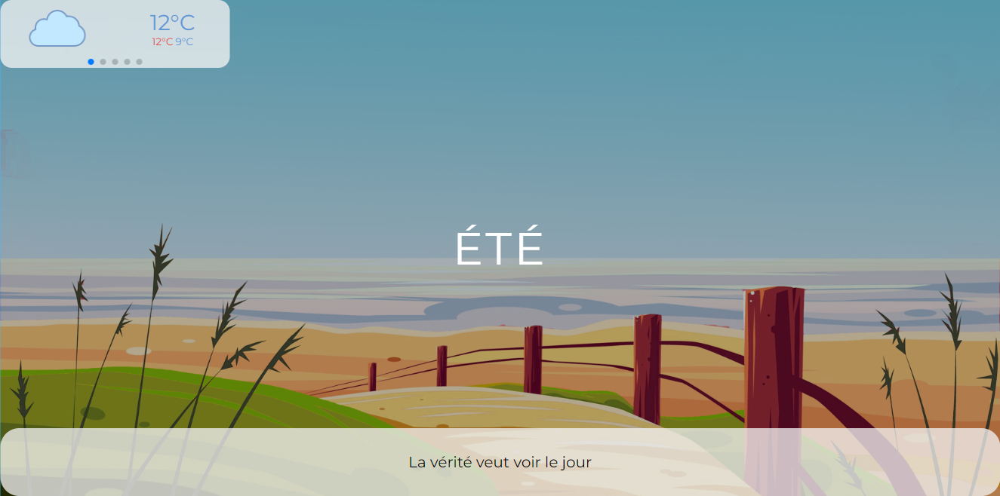
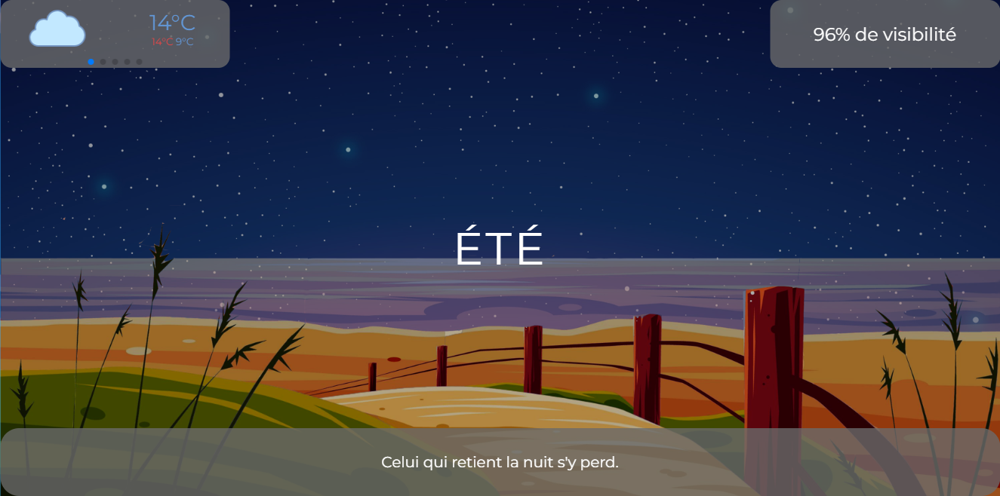

#  Projet Site de Météo & Saison (Projet Personnel)
## avec React JS

    
    

        <h4 topmargin="0" bottommargin="0">Aperçu du site de jour</h4>
    

    
    

        <h4 topmargin="0" bottommargin="0">Aperçu du site de nuit</h4>
    

